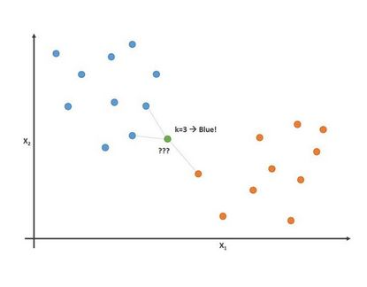
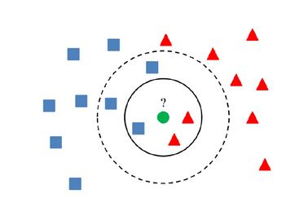
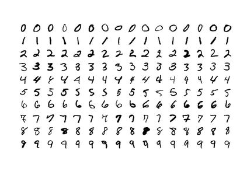

IMPLEMENTATION OF K NEAREST NEIGHBORS IN JAVA

K Nearest Neighbors is a non-parametric, instanced-based learning algorithm
Non-parametric meaning that instead of using a probability distribution derived from the data. It is compared directly against the training data
Instance-based learning, lazy learning, instead of creating an abstraction from the training data, it instead stores all the training data and compares the query to the data and classifies it according to its nearest neighbors

WHAT IS K NEAREST NEIGHBORS

K Nearest Neighbors is a simple algorithm where the test data is compared to all training data points by using one of the methods to find distance between it and the rest of the data, takes the K nearest data points and then classifies the test data according to whatever the majority that its nearest neighbors are.

Which Formula
A study on KNN showed that the depending on the data, different equations performed better
Two of  the most common equations:
The most used formula is the normalized Euclidean function 𝑑𝑖𝑠𝑡(𝐴,𝐵)=√((∑_(𝑖=1)^𝑚▒〖(𝑥_𝑖−𝑦_𝑖 〗 )^2)/𝑚)
Cosine Similarity Measure is used to measure the cosine angle between two vectors cosθ=(𝐴∗𝐵)/(|𝐴||𝐵|)
We chosen to use the normalized Euclidean distance function.

How to Choose K
There is no set way to find K so we will first set K to the square root of n, where n is the number of training data entries:
Large values for K can take a long time computationally, and if it is too large then everything is the most probable class
Small values for K, noisy values can have a large effect

Pros/Cons of K Nearest Neighbors
Pros
No assumptions are made about the data
Simple, its is easy to explain and understand
High Accuracy-it excels in classification
Classifier can updated easily as new instances with known classes are added

Cons
Since each testing data point is compared to all the training data points it can be computationally expensive
It can sensitive to noisy data, outliers
Sensitive to very unbalanced datasets

The Data Set
We are using MNIST data of handwritten digits, it contain a data set of  70,000 handwritten digits from 0-9. 60,000 of these used for training purposes while the remaining 10,000 are used to test the algorithm's accuracy.  

Mnist
Each of these images in the dataset are 28 by 28 and are gray scale. This means that each image can be thought of as a 28 by 28 matrix with each cell representing a pixel, the pixels’ values range from 0-255, with 0 being white and 255 being black. The benefit of the data being in gray scale is that only one matrix needs to be used.  We treat the matrix as one long vector with 784 dimensions. 

The highest performance of KNN is around 97%. We reached 97% in accuracy vs the test images and consistently had 97-98 percent on the validation tests.

To use the program, just download it the paths are already set to the data folder provided to it and run it,
changing k in the public static void main in the knn.java file will change the number of neighbors it will be compared to

changing the testing boolean to true in the same file will switch it to validation testing, the validation testing will split the training array into two arrays and will use 10000 of these randomly selected training data as the test data and other 50,000 as the training data,
remeber to change k to the value you want to start with and the 30 in the while loop, while(k<30), to what you want the program to end at.
